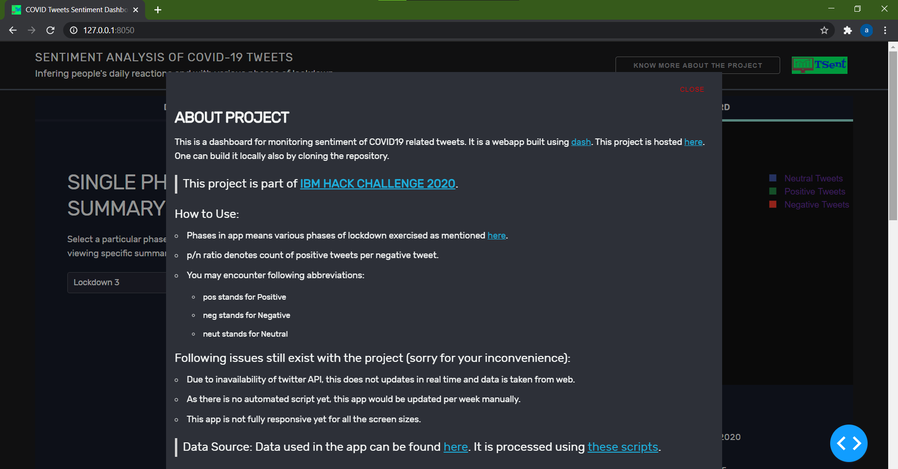

# Sentiment Analysis Dashboard of COVID-19 tweets 

This Project is part of [**IBM Hack Challenge 2020**](https://smartinternz.com/ibm-hack-challenge-2020). It is a visualization dashboard Webapp imitating descriptive statistics and summaries of COVID-19 tweets data.

<br/>

**Webapp is deployed on IBM cloud and can be found [here]().**
 
<br/>

## Built With
* [Dash](https://plotly.com/dash/)
* [Plotly](https://plotly.com/)

<br/>

## Data
> Data for this app is taken from [here](https://ieee-dataport.org/open-access/coronavirus-covid-19-tweets-dataset) due to inavailability of twitter API

<br/>

## Features
* Minimal and Cool UI
* Qualitative analysis with plots
* Lightweight (fast loading speed)
* Supports user interactions

<br/>

## Running App locally

### Linux/MacOS
* To be updated...

### Windows

* Make sure you have Python3 on your path.
* Clone the repository 
  > `git clone https://github.com/SmartPracticeschool/SBSPS-Challenge-4564-Sentiment-Analysis-Dashboard-of-COVID-19-tweets.git`.
1. (optional) create and activate new virtualenv or conda env:

```
pip install virtualenv
virtualenv venv
source venv/bin/activate
```

or, with conda:
```
conda create --yes -n dash_docs
source activate dash_docs
```

2. `pip install -r requirements.txt`
3. `python app.py` 

<br/>

## Limitations
* This app is not yet responsive for all screen sizes and that's why while loading, it throws an alert for the same.
* As there was no access to twitter's API, the data is taken from web and sentiment of tweets used was precomputed using [textblob](https://textblob.readthedocs.io/en/dev/).
* This app would be updated manually per week, as there is no automation script yet for the tasks.


<br/>

## Screenshots




